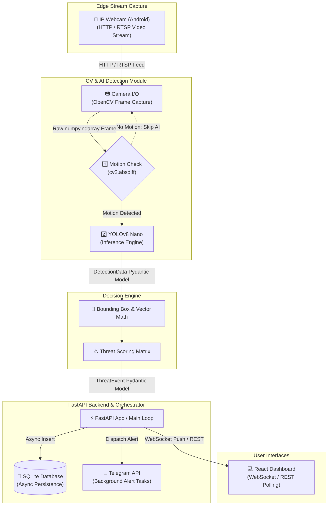

# Agri-Shield: System Architecture & Data Flow Document

## 1. Overview & System Purpose

**Agri-Shield** is an AI-powered agricultural monitoring and threat detection system. It ingests live video streams from an Android device running an IP Webcam, performs efficient two-stage computer vision analysis to identify intrusions (such as wildlife, livestock, or unauthorized personnel near crop perimeters), calculates movement vectors and threat scores, and dispatches real-time alerts to farmers via Telegram while streaming real-time status updates to a React web dashboard.

---

## 2. End-to-End System Architecture



---

## 3. Detailed Component Breakdown

### 3.1 Edge Stream Capture (`IP Webcam`)
- **Source**: Android mobile device mounted near field perimeters running an IP Webcam application.
- **Protocol**: HTTP MJPEG stream or RTSP.
- **Responsibility**: Provides continuous high-definition visual feed of monitored agricultural areas.

### 3.2 CV & AI Detection Module
- **Frame Ingestion**: `OpenCV` continuously reads frames from the HTTP/RTSP stream as raw `numpy.ndarray` objects.
- **Stage 1 (Lightweight Motion Filter)**:
  - Uses `cv2.absdiff()` against a running frame average or keyframe background.
  - If frame variance is below threshold, frame processing halts immediately, conserving GPU/CPU cycles.
- **Stage 2 (Deep Learning Inference)**:
  - When motion exceeds threshold, the frame is passed to **YOLOv8 Nano**.
  - Detects relevant target classes (e.g., `person`, `cow`, `elephant`, `wild boar`, `dog`).
  - Output is standardized into a `DetectionData` Pydantic model.

### 3.3 Decision Engine
- **Bounding Box Math & Movement Vectors**:
  - Calculates object centroids across consecutive frames to compute velocity, direction vector, and path trajectory.
- **Threat Level Scoring**:
  - Evaluates target class, movement direction (approaching vs moving away), and proximity to defined crop zones.
  - Categorizes threat level: `NONE`, `LOW`, `MEDIUM`, `HIGH`, `CRITICAL`.
  - Output is standardized into a `ThreatEvent` Pydantic model.

### 3.4 FastAPI Backend & Orchestrator
- **Central Event Router**:
  - Receives `ThreatEvent` objects from the processing loop.
  - **Storage**: Asynchronously writes threat logs and detection metadata into **SQLite** using `aiosqlite` / `SQLAlchemy async`.
  - **Notifications**: Enqueues non-blocking background tasks to push Telegram alerts with cropped threat images.
  - **Real-Time Stream**: Pushes state updates over a **WebSocket** connection to active web clients.

### 3.5 React Dashboard & Telegram Integration
- **Telegram Bot**: Sends instant push notifications with event severity, detected target class, and snapshot image.
- **React Dashboard**: Interactive web UI offering live video overlays, historic threat logs, analytics graphs, and configurable perimeter zones.

---

## 4. Data Models & Contracts (`Pydantic`)

To enforce strict typing and boundary separation, data flowing through the pipeline uses Pydantic contracts:

### `DetectionData` Schema
```python
from pydantic import BaseModel, Field
from typing import List, Tuple

class BoundingBox(BaseModel):
    x_min: float
    y_min: float
    x_max: float
    y_max: float
    confidence: float
    class_name: str
    class_id: int

class DetectionData(BaseModel):
    frame_id: int
    timestamp: float
    motion_detected: bool
    detections: List[BoundingBox] = Field(default_factory=list)
```

### `ThreatEvent` Schema
```python
from pydantic import BaseModel
from typing import List, Optional

class ThreatEvent(BaseModel):
    event_id: str
    timestamp: float
    threat_level: str  # NONE, LOW, MEDIUM, HIGH, CRITICAL
    target_class: str
    confidence: float
    vector: Tuple[float, float]  # (dx, dy) movement direction
    snapshot_path: Optional[str] = None
    requires_alert: bool
```

---

## 5. Potential System Conflicts & Technical Resolutions

| Potential Conflict / Issue | Root Cause | Architectural Resolution |
| :--- | :--- | :--- |
| **Stream Latency & Frame Buffering** | High RTSP/HTTP buffering causing lag in CV inference. | Implement frame-skipping / buffer-clearing worker thread in `camera/` that always yields the most recent frame (`grab()` & `retrieve()`). |
| **Database Bottlenecks during High FPS** | Synchronous SQLite writes blocking FastAPI event loop. | Use asynchronous SQLite driver (`aiosqlite` / `SQLAlchemy async`) and batch low-priority logs while immediately writing high-threat events. |
| **Telegram API Rate Limits & Blocking** | Synchronous HTTP calls to Telegram API blocking stream processing. | Dispatch Telegram notifications exclusively via FastAPI `BackgroundTasks` or an async task queue (`asyncio.create_task`). |
| **Network Instability from IP Webcam** | Unstable Wi-Fi/cellular connection dropping video feed. | Wrap video capture in an auto-reconnecting generator loop with exponential backoff strategy in `camera/`. |
