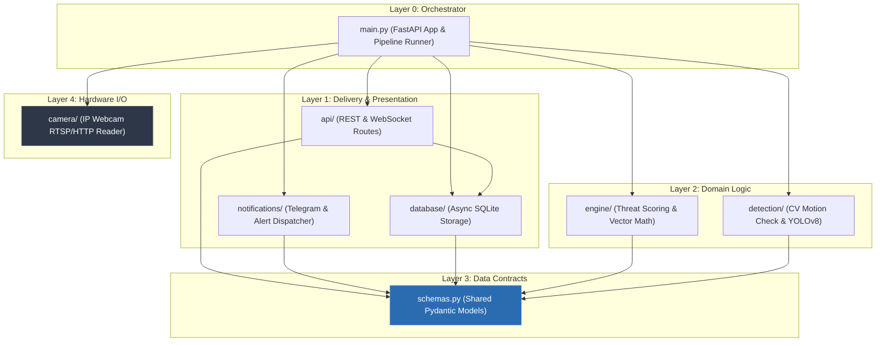

# Agri-Shield: Dependency Flow & Layer Hierarchy Document

## 1. Architectural Principles

To ensure maintainability, testability, and clean decoupling across the **Agri-Shield** codebase, the project enforces a **Strict Downward Dependency Rule**:

1. **Upper layers orchestrate lower layers**.
2. **Lower layers MUST NEVER import upper layers** (No upward dependencies).
3. **Peer layers communicate exclusively via shared data schemas (`schemas.py`)**.
4. **Hardware and IO layers are pure dependencies** with zero internal domain logic.

---

## 2. Dependency Hierarchy Diagram

---

## 3. Layer Breakdown & Import Rules

### `main.py` (Top-Level Orchestrator)
- **Role**: Root application entry point, lifecycle manager, and background worker loop starter.
- **Allowed Imports**: `api`, `notifications`, `database`, `engine`, `detection`, `camera`, `schemas`, `config`.
- **Restricted**: No other file may import `main.py` (prevents circular imports).

### `api/` & `notifications/` & `database/` (Delivery / Service Layer)
- **Role**: Serves HTTP/WebSocket requests, sends external notifications (Telegram), and persists records to SQLite.
- **Allowed Imports**: `schemas.py`, `config.py`.
- **Restricted**: Must NOT import `main.py` or directly invoke `detection`/`camera` streaming code.

### `engine/` (Decision & Threat Scoring)
- **Role**: Evaluates detection results, computes movement direction vectors, and determines threat severity.
- **Allowed Imports**: `schemas.py` (e.g., consumes `DetectionData` and produces `ThreatEvent`).
- **Restricted**: Must NOT import `detection/`, `camera/`, `database/`, or `api/`.

### `detection/` (AI & Computer Vision Pipeline)
- **Role**: Performs 2-stage vision logic (Motion detection `cv2.absdiff` -> YOLOv8 inference).
- **Allowed Imports**: `schemas.py` (produces `DetectionData`), third-party libraries (`cv2`, `ultralytics`).
- **Restricted**: Must NOT import `engine/`, `database/`, `notifications/`, `api/`, or `main.py`.

### `schemas.py` (Core Data Models)
- **Role**: Contains pure data definitions (Pydantic models like `DetectionData`, `ThreatEvent`, `BoundingBox`).
- **Allowed Imports**: `pydantic`, Python stdlib (`typing`, `enum`).
- **Restricted**: Must NOT import any project module. Pure contract file.

### `camera/` (Hardware Stream I/O)
- **Role**: Connects to Android IP Webcam stream, reads raw frames, and yields them as `numpy.ndarray`.
- **Allowed Imports**: `cv2`, `time`, `config.py`, Python stdlib.
- **Restricted**: **IMPORTS NOTHING** from project domain layers (`schemas`, `engine`, `detection`, `database`, `api`).

---

## 4. Reconciliation with Initial Project Structure

The initial folder creation used placeholder module names. Below is the mapping and resolution to align the directory structure with the strict dependency flow:

| Initial Folder Structure | Resolved Package Structure | Responsibility & Import Rule |
| :--- | :--- | :--- |
| `backend/cv_pipeline/detector.py` | Split into `backend/camera/` & `backend/detection/` | `camera/` captures raw frames (0 domain imports). `detection/` handles motion filtering & YOLO inference. |
| `backend/integrations/telegram_bot.py` | `backend/notifications/telegram_bot.py` | Handles async Telegram alert dispatches. Imports `schemas.py` & `config.py`. |
| `backend/engine/analyzer.py` | `backend/engine/analyzer.py` | Decision engine logic. Imports `schemas.py`. |
| `backend/database/models.py` | `backend/database/models.py` | SQLite database models & async session manager. |
| *(Missing)* | `backend/schemas.py` | Added as the central, decoupled domain contract layer for Pydantic models. |
| *(Missing)* | `backend/api/` | Added for FastAPI REST routes & WebSocket endpoint setup. |

---

## 5. Summary of Resolved Conflicts

1. **Decoupling CV Logic from Hardware Capture**:
   - *Conflict*: Placing IP Webcam connection and YOLO inference together in `cv_pipeline/detector.py` breaks modularity and makes unit testing difficult without an active stream.
   - *Resolution*: Separated into `camera/` (pure stream producer) and `detection/` (frame analyzer accepting `numpy.ndarray` inputs).

2. **Preventing Circular Dependencies between Engine and Detection**:
   - *Conflict*: If `detection` calls `engine` directly to process threats, or `engine` calls `detection` to request frames, tight coupling occurs.
   - *Resolution*: Both modules interact solely via `schemas.py` contracts (`DetectionData` & `ThreatEvent`), orchestrated at top level by `main.py`.

3. **Non-Blocking Alert Dispatching**:
   - *Conflict*: Synchronous Telegram calls inside `engine/` or `detection/` cause frame drops during network latency.
   - *Resolution*: Notifications are handled at the `main.py` / `notifications/` layer using non-blocking async background tasks.
